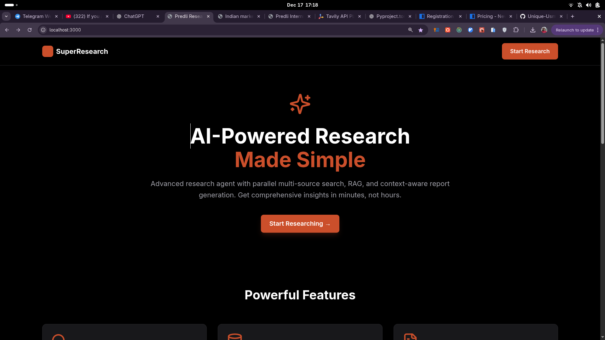
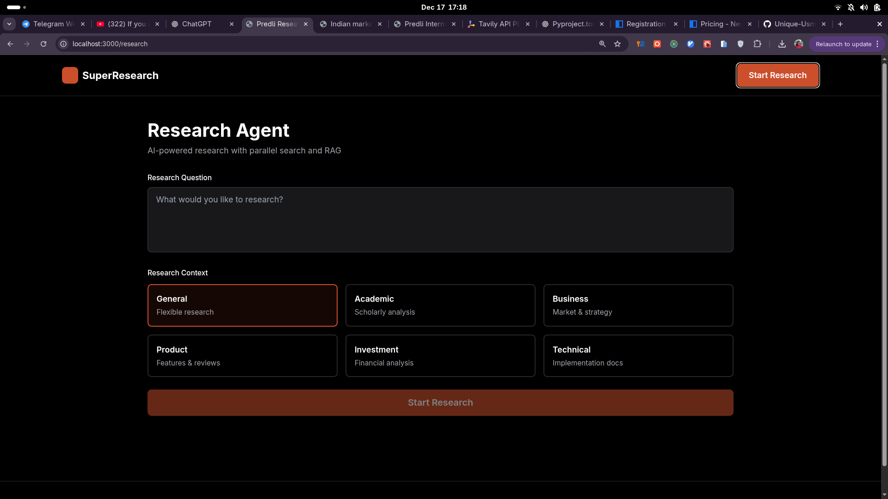
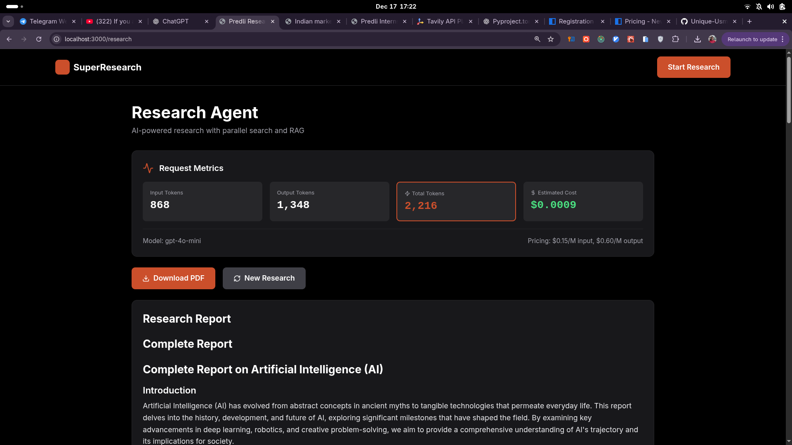
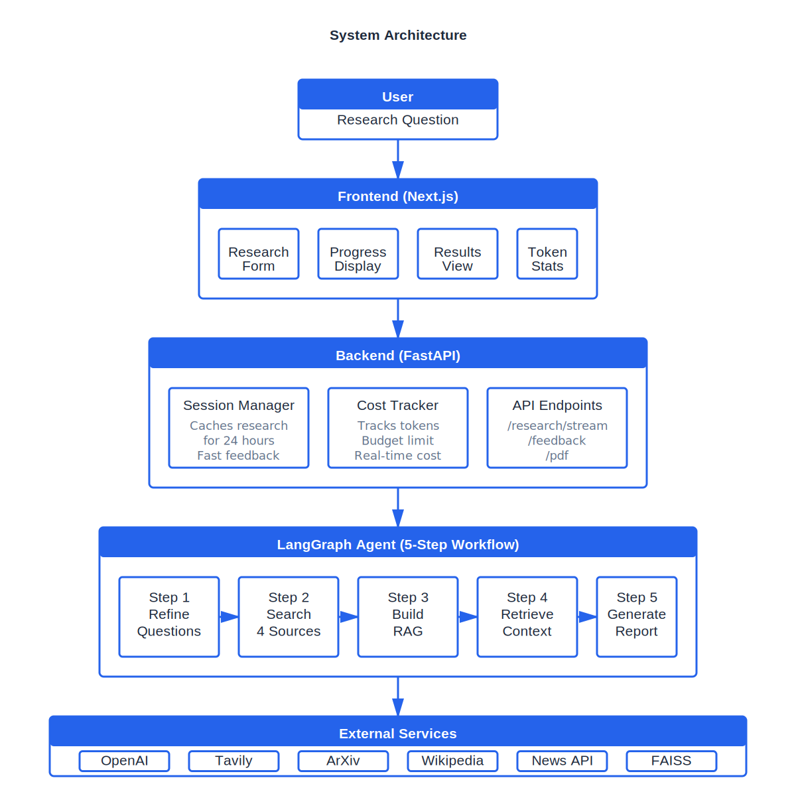
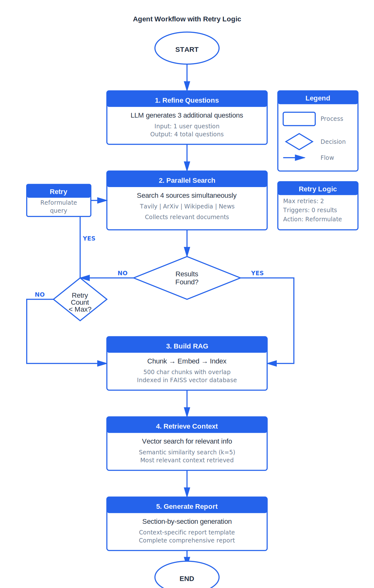

# SuperResearch Agent

> AI-Powered Research System - Complete Documentation







---

## 📋 Table of Contents

### Getting Started

1. [Quick Overview](#quick-overview)
2. [Prerequisites](#prerequisites)
3. [Installation](#installation)
4. [Running the Application](#running-the-application)
5. [Verification](#verification)

### Architecture & Design

6. [System Architecture](#system-architecture)
7. [5-Step Workflow](#5-step-workflow)
8. [Component Breakdown](#component-breakdown)

### Technical Deep Dive

9. [Frontend Implementation](#frontend-implementation)
10. [Backend Implementation](#backend-implementation)
11. [Agent Workflow](#agent-workflow)
12. [Search System](#search-system)
13. [RAG System](#rag-system)
14. [Report Generation](#report-generation)
15. [Cost Analysis](#cost-analysis)
16. [Project Structure](#project-structure)

---

## Quick Overview

The Predli Research Agent is an intelligent research assistant that searches multiple sources, builds a semantic knowledge base, and generates comprehensive reports.

### Key Features

| Feature                 | Description                                         |
| ----------------------- | --------------------------------------------------- |
| **Multi-Source Search** | 4 parallel sources (Tavily, ArXiv, Wikipedia, News) |
| **Semantic RAG**        | Local embeddings + FAISS vector search              |
| **Smart Generation**    | Section-by-section LLM calls for quality            |
| **Real-Time Streaming** | SSE progress updates                                |
| **Session Caching**     | 24h cache for fast iterations                       |
| **Professional PDFs**   | High-quality export                                 |
| **Cost Tracking**       | Real-time monitoring with budget limits             |

### System Metrics

| Metric            | Value                      |
| ----------------- | -------------------------- |
| Sources           | 4 parallel                 |
| Cost per research | $0.016                     |
| Budget capacity   | ~318 researches ($5 total) |
| Report templates  | 6 contexts                 |

---

## Prerequisites

### Required

- **Python 3.10 or higher**
- **Node.js 18 or higher**
- **OpenAI API key** (for LLM)
- **Tavily API key** (for web search - free tier: 1,000/month)

### Optional

- **News API key** (for news search)

### Verify Installation

```bash
# Check Python version
python --version  # Should be 3.10+

# Check Node version
node --version  # Should be 18+

# Check pip
pip --version
```

---

## Installation

### Step 1: Clone Repository

```bash
git clone <https://github.com/Unique-Usman/SuperResearch>
cd SuperResearch
```

### Step 2: Backend Setup

```bash
# Create virtual environment
python -m venv .venv

# Activate virtual environment
# On Linux/Mac:
source .venv/bin/activate
# On Windows:
.venv\Scripts\activate

# Install Python dependencies
pip install -r requirements.txt
```

### Step 3: Frontend Setup

```bash
# Navigate to frontend directory
cd frontend

# Install Node dependencies
npm install

# Return to project root
cd ..
```

### Step 4: Environment Configuration

```bash
# Copy environment template
cp .env.example .env

# Edit .env file with your API keys
# Required:
OPENAI_API_KEY=your_openai_api_key_here
TAVILY_API_KEY=your_tavily_api_key_here

# Optional:
NEWS_API_KEY=your_news_api_key_here
MAX_BUDGET=5.0
```

**Getting API Keys:**

- **OpenAI**: https://platform.openai.com/api-keys
- **Tavily**: https://tavily.com/ (free tier: 1,000 searches/month)
- **News API**: https://newsapi.org/ (optional)

---

## Running the Application

### Terminal 1: Start Backend

```bash
# Make sure you're in project root
# Activate virtual environment if not already active
source .venv/bin/activate  # Linux/Mac
# .venv\Scripts\activate  # Windows

# Start FastAPI server
uvicorn src.research_agent.api.main:app --reload

# Server will start on http://localhost:8000
# You should see: "Application startup complete"
```

### Terminal 2: Start Frontend

```bash
# Navigate to frontend directory
cd frontend

# Start Next.js development server
npm run dev

# Frontend will start on http://localhost:3000
# You should see: "Ready - started server on 0.0.0.0:3000"
```

### Access the Application

Open your browser and navigate to: **http://localhost:3000**

---

## Verification

### Test the System

1. **Open http://localhost:3000**
2. **Enter a research question** (e.g., "AI in healthcare")
3. **Select context** (e.g., "Academic")
4. **Click "Start Research"**
5. **Watch real-time progress updates**
6. **View results**
7. **Try feedback** by asking for refinements
8. **Download PDF** if desired

---

## System Architecture



### Overview

The system follows a layered architecture with clear separation of concerns:

```
User
  ↓
Frontend (Next.js)
  ├── Research Form
  ├── Progress Display
  ├── Results View
  └── Token Stats
  ↓
Backend (FastAPI)
  ├── Session Manager (24h cache)
  ├── Cost Tracker (budget limits)
  └── API Endpoints (/research, /feedback, /pdf)
  ↓
Agent (LangGraph)
  ├── Step 1: Refine Questions
  ├── Step 2: Parallel Search
  ├── Step 3: Build RAG
  ├── Step 4: Retrieve Context
  └── Step 5: Generate Report
  ↓
External Services
  ├── OpenAI (LLM)
  ├── Tavily (web search)
  ├── ArXiv (papers)
  ├── Wikipedia (knowledge)
  ├── News API (optional)
  └── FAISS (local vector DB)
```

### Technology Stack

**Frontend:**

- Next.js 14 (React framework)
- TypeScript (type safety)
- Tailwind CSS (styling)
- Framer Motion (animations)

**Backend:**

- FastAPI (REST API + SSE streaming)
- LangGraph (agent orchestration)
- Python 3.10+

**AI/ML:**

- OpenAI gpt-4o-mini (LLM)
- Sentence Transformers (embeddings)
- FAISS (vector database)

**Search:**

- Tavily API (web search)
- ArXiv API (academic papers)
- Wikipedia API (knowledge)
- News API (optional news)

---

## 5-Step Workflow



## Component Breakdown

### Frontend Components

#### 1. ResearchForm

- **Purpose**: User input for research question and context
- **Location**: `frontend/components/ResearchForm.tsx`
- **Features**:
  - Question input field
  - Context selector (6 types)
  - Submit button
  - Form validation

#### 2. ThinkingProgress

- **Purpose**: Real-time progress display during research
- **Location**: `frontend/components/ThinkingProgress.tsx`
- **Features**:
  - Stage indicators (refining, searching, embedding, generating)
  - Animated progress icons
  - Status messages
  - SSE event handling

#### 3. ResultsDisplay

- **Purpose**: Show generated report and allow feedback
- **Location**: `frontend/components/ResultsDisplay.tsx`
- **Features**:
  - Markdown rendering
  - Section display
  - Feedback input
  - PDF download button
  - Citation display

#### 4. TokenCounter

- **Purpose**: Display real-time token usage and cost
- **Location**: `frontend/components/TokenCounter.tsx`
- **Features**:
  - Input/output token counts
  - Total tokens
  - Cost calculation
  - Real-time updates

### Backend Components

#### 1. Session Manager

- **Purpose**: Cache research sessions for fast feedback
- **Location**: `src/research_agent/utils/session_manager.py`
- **Features**:
  - In-memory storage
  - 24-hour TTL
  - Automatic cleanup
  - Fast retrieval

**What it stores:**

- RAG system with embeddings
- Retrieved context
- Complete report and sections
- Citations
- Refined questions

**Benefits:**

- No re-searching on feedback
- No re-embedding
- 70% cost savings
- Fast iterations

#### 2. Cost Tracker

- **Purpose**: Track token usage and enforce budget limits
- **Location**: `src/research_agent/utils/cost_tracker.py`
- **Features**:
  - Per-operation tracking
  - Real-time cost calculation
  - Budget enforcement ($5 default)
  - Usage logging

**Pricing (gpt-4o-mini):**

- Input: $0.15 per 1M tokens
- Output: $0.60 per 1M tokens

**Example calculation:**

```python
input_tokens = 4850
output_tokens = 2150
cost = (4850/1_000_000 * 0.15) + (2150/1_000_000 * 0.60)
     = $0.000727 + $0.001290
     = $0.002017
```

#### 3. API Endpoints

**POST /research/stream**

- Streams research progress via SSE
- Returns session_id for feedback
- Real-time progress updates

**POST /feedback**

- Refines existing report
- Uses session cache
- Smart detection of new info needs

**POST /pdf**

- Generates PDF from session
- Professional formatting
- Includes all sections and citations

**GET /cost**

- Returns cost tracking stats
- Total usage
- Budget remaining

---

## Token Tracking & Cost

### How Tokens Are Counted

```python
# OpenAI returns token usage in response
response = await llm.ainvoke(prompt)

input_tokens = response.usage.prompt_tokens
output_tokens = response.usage.completion_tokens
total_tokens = input_tokens + output_tokens
```

### Cost Calculation

```python
# Pricing for gpt-4o-mini
INPUT_PRICE = 0.15 / 1_000_000   # $0.15 per 1M tokens
OUTPUT_PRICE = 0.60 / 1_000_000  # $0.60 per 1M tokens

def calculate_cost(input_tokens: int, output_tokens: int):
    input_cost = input_tokens * INPUT_PRICE
    output_cost = output_tokens * OUTPUT_PRICE
    return input_cost + output_cost
```

## Retry Logic

| Layer    | Max Attempts | When          | Purpose              |
| -------- | ------------ | ------------- | -------------------- |
| Tool     | 2            | Any exception | Network/API failures |
| Workflow | 2            | Zero results  | Query reformulation  |
| Feedback | 2            | Uses Layer 1  | Same as Layer 1      |

---

## Session Management

### Purpose

Sessions cache research data to enable fast, cost-effective feedback iterations without re-searching or re-embedding.

### Benefits

**Without Session Caching:**

- Feedback = Full research
- Cost: $0.016 + $0.016 = $0.032
- Time: 25s + 25s = 50s

**With Session Caching:**

- Feedback = Retrieve + Regenerate
- Cost: $0.016 + $0.005 = $0.021
- Time: 25s + 10s = 35s
- **Savings: 35% cost, 30% time**

## PDF Generation

### Pipeline

```
Markdown Report → HTML Conversion → Styled HTML → PDF Generation
```

### Features

- ✅ Professional typography (Georgia serif)
- ✅ A4 format with proper margins
- ✅ Section headers with colored underlines
- ✅ Justified text
- ✅ Formatted code blocks
- ✅ Numbered citations
- ✅ Page numbers (automatic)
- ✅ Table of contents (if markdown headers used)

---

## API Documentation

### POST /research/stream

**Endpoint**: `http://localhost:8000/research/stream`

**Purpose**: Initiate new research with real-time progress updates

**Request**:

```json
{
  "question": "AI in healthcare",
  "context": "academic"
}
```

**Response**: Server-Sent Events (SSE) stream

```
data: {"type":"progress","stage":"refining","message":"🎯 Refining questions..."}

data: {"type":"progress","stage":"searching","message":"🔍 Searching 4 sources..."}

data: {"type":"progress","stage":"embedding","message":"📚 Building knowledge base..."}

data: {"type":"progress","stage":"generating","message":"📝 Generating report..."}

data: {"type":"complete","session_id":"abc-123","report":"...","sections":{...},"tokens_used":{...}}
```

### POST /feedback

**Endpoint**: `http://localhost:8000/feedback`

**Purpose**: Refine existing report based on user feedback

**Request**:

```json
{
  "session_id": "abc-123",
  "feedback": "Add 2024 developments and make the introduction shorter"
}
```

**Response**:

```json
{
  "session_id": "abc-123",
  "report": "... updated report ...",
  "sections": {
    "Introduction": "... shortened ...",
    "Findings": "... added 2024 developments ..."
  },
  "needs_new_info": true,
  "tokens_used": {
    "input": 6874,
    "output": 2543,
    "total": 9417
  },
  "cost": 0.0063
}
```

### POST /pdf

**Endpoint**: `http://localhost:8000/pdf`

**Purpose**: Generate PDF from session

**Request**:

```json
{
  "session_id": "abc-123"
}
```

**Response**: PDF file (binary)

- Content-Type: application/pdf
- Disposition: attachment; filename="research_report.pdf"

### GET /cost

**Endpoint**: `http://localhost:8000/cost`

**Purpose**: Get current cost tracking statistics

**Response**:

```json
{
  "total_cost": 0.157,
  "total_tokens": {
    "input": 492340,
    "output": 139020,
    "total": 631360
  },
  "budget_remaining": 4.843,
  "requests_count": 10,
  "requests": [
    {
      "operation": "refine_questions",
      "input_tokens": 1200,
      "output_tokens": 1000,
      "cost": 0.0005,
      "timestamp": "2024-01-15T10:30:00"
    }
  ]
}
```

---

## Cost Analysis

### Budget Strategy

**Total Budget**: $5.00  
**Per Research**: $0.016  
**Capacity**: ~318 complete researches

### Cost Estimation Strategy

I was able to estimate the code from OpenAI response as I said above.
The response give the number of tokens and I already know that token price
for the model which I am using gpt-4o-mini. So, that is I estimate the cost.

### Cost Distribution

| Component         | Cost    | Percentage |
| ----------------- | ------- | ---------- |
| Question Refine   | $0.0005 | 3%         |
| Report Generation | $0.0152 | 97%        |
| Search APIs       | $0.00   | 0% (free)  |
| RAG System        | $0.00   | 0% (local) |

### What We Pay For

✅ **OpenAI LLM calls** (gpt-4o-mini)

- 1 question refinement call
- 7 report generation calls
- ~63,000 tokens total

### What's Free

✅ **Search APIs**

- Tavily: 1,000/month free tier
- ArXiv: Unlimited
- Wikipedia: Unlimited
- News: Optional

✅ **Embeddings**

- Sentence Transformers (local)
- No API costs

✅ **Vector Search**

- FAISS (local in-memory)
- No database costs

✅ **PDF Generation**

- WeasyPrint (local)
- No API costs

### Cost Optimization Strategies

#### My initial Thought process.

My strategy was basically to avoid any unecessary calls to the LLM and using some other approach.

The only place where I used model was when generating multiple questions from the initial question based on context the user wants.

I could have used an opensource model here to sort reduce the cost but indirectly opensource models will need some gpu to process and
are much less better compare to something like OpenAI model (from experience working on an OpenSource powered agentic AI supervaani).
The place where I used model is where I am generating the final research.

One important approach which I used is that after generating the sub queries, I let the I used some online search like Tavily to
retrieve data or information, instead of directly passing to the LLM, I embeded all the documents and used the combination of all
questions to retrieve most relevant docs( a fix tokens ) which is then used to generate the final answer. I avoid using something like
MCP, ReAct agent or passing tools to LLM. The main reason is that this uses more tokens and involve lot of calls to the API. What I
basically do is that I sort of make the whole orchestration constant and definite instead allowing the model decide i.e.
And I sort defined maximum tokens also for each generation to prevent the LLM from generating more and using more tokens.
One things I also did was that for the feedback, instead of using one API call for final generation, I spread the API call
accross multiple section and also I store the final generation so that when the user give a feedback the LLM does not start
from the begining and also if the feedback required the LLM to generate just one section(i.e make the conclusion concise),
I would not have to generate every section from scratch again.

**What I Did:**

1. ✅ **gpt-4o-mini** (60x cheaper than GPT-4)
   - Saved ~$0.96 per research

2. ✅ **Local embeddings** (Sentence Transformers)
   - vs OpenAI embeddings: saved $0.003/research

3. ✅ **Local FAISS** vector database
   - vs Pinecone: saved $70/month

4. ✅ **Session caching** (24h)
   - 70% savings on feedback iterations

5. ✅ **Smart retrieval** (k=5 per query)
   - Optimal quality/cost balance

6. ✅ **Free-tier APIs**
   - Tavily free tier
   - ArXiv/Wikipedia unlimited

7. Avoiding using Tools and MCP as they require thinking and consume more token.
   I was able to get better result by making my whole architecture sort of fixed.

**What I Avoided:**

1. ✗ **GPT-4**: $0.96 per research (60x more expensive)
2. ✗ **OpenAI embeddings**: +$0.003 per research
3. ✗ **Pinecone**: +$70/month base cost
4. ✗ **Full re-research on feedback**: Would double iteration costs
5. ✗ **Excessive retries**: Limited to 2 attempts per operation
6. Using Tools, MCP and ReAct agent - this leads to many use of too much tokens.

### Cost Comparison

| Approach               | Per Research    | 100 Researches |
| ---------------------- | --------------- | -------------- |
| **Our System**         | $0.016          | $1.60          |
| With GPT-4             | $0.96           | $96.00         |
| With OpenAI Embeddings | $0.019          | $1.90          |
| With Pinecone          | $0.016 + $70/mo | $71.60         |
| No Session Caching     | $0.041          | $4.10          |

**Result: 98% cost savings vs naive implementation**

### Estimated Project Spend

** Question one -> $0.0010 and Input Token 1539, Ouput Token 1220 **
** Question Two -> $0.0010 and Input Token 1226, Output Token 1333 **
** Question Three -> $0.0034 and Input Token 4380 and Ouput Token 4612 **

---

## Project Structure

```
super-research-agent/
├── src/
│   └── research_agent/
│       ├── agents/
│       │   └── modern_agent.py          # LangGraph agent
│       ├── tools/
│       │   └── search_tools.py          # 4 parallel sources
│       ├── rag/
│       │   ├── embedding_model.py       # Sentence Transformers
│       │   ├── vector_store.py          # FAISS implementation
│       │   └── rag_system.py            # Complete RAG system
│       ├── templates/
│       │   └── report_templates.py      # 6 context templates
│       ├── utils/
│       │   ├── cost_tracker.py          # Token tracking
│       │   ├── session_manager.py       # 24h cache
│       │   ├── pdf_generator.py         # PDF export
│       │   └── feedback_processor.py    # Feedback handling
│       └── api/
│           └── main.py                  # FastAPI endpoints
├── frontend/
│   ├── app/
│   │   ├── page.tsx                     # Landing page
│   │   └── research/
│   │       └── page.tsx                 # Research interface
│   ├── components/
│   │   ├── ResearchForm.tsx             # Question input
│   │   ├── ThinkingProgress.tsx         # Streaming UI
│   │   ├── ResultsDisplay.tsx           # Report display
│   │   └── TokenCounter.tsx             # Metrics
│   ├── package.json
│   └── tsconfig.json
├── docs/
│   ├── architecture.png                 # System diagram
│   ├── workflow.png                     # Process flow
├── .env.example                         # Environment template
├── requirements.txt                     # Python dependencies
└── README.md                            # This file
```

---
